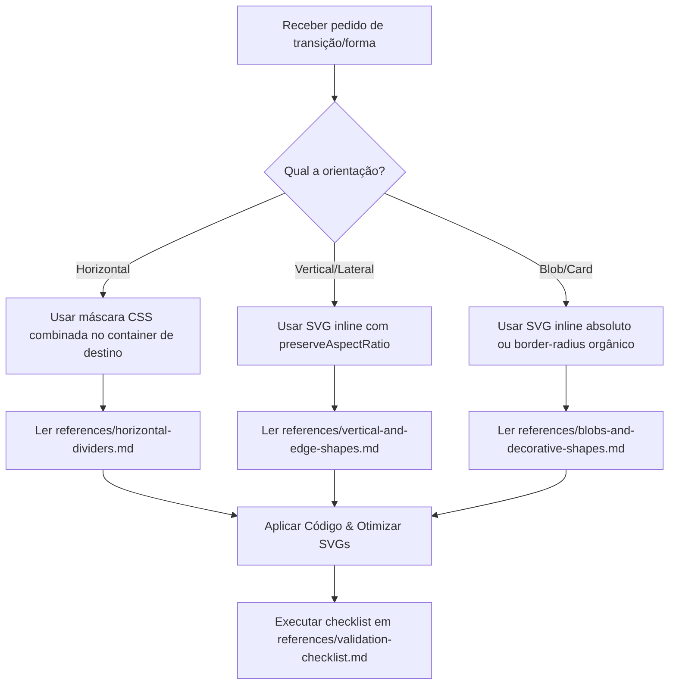

# 🎨 SVG Shape Composer Skill

Esta skill capacita a IA e desenvolvedores a integrarem divisores de seção (Shape Dividers) e formas decorativas orgânicas ou geométricas de forma responsiva, otimizada para hardware e sem bugs de renderização comuns (como faixas retas pretas, distorções ou travamento de scroll).

---

## 📂 Estrutura da Skill

Quando esta skill for invocada ou copiada, a seguinte estrutura de arquivos deve ser mantida:

```text
svg-shape-composer/
├── SKILL.md                          # Diretrizes gerais e fluxo de decisão (este arquivo)
└── references/
    ├── horizontal-dividers.md        # Receita de máscaras CSS horizontais direta no container
    ├── vertical-and-edge-shapes.md   # Receitas para curvas e bordas com SVG inline responsivo
    ├── blobs-and-decorative-shapes.md # Guia de uso para blobs e camadas decorativas em cards
    └── validation-checklist.md       # Lista de verificação e checagem de erros antes do deploy
```

---

## 🧠 Fluxo de Decisão do Agente

Ao receber uma solicitação para aplicar um divisor ou forma decorativa, o agente deve seguir este protocolo:



1. **Classificação do Shape:** Identificar se a transição é de empilhamento horizontal (ex: onda entre seções), vertical (ex: divisão de colunas), borda de página (ex: `.gold-edge`) ou meramente decorativa (ex: blob).
2. **Seleção de Recursos:** Escolher o SVG apropriado do repositório de recursos (`docs/landing-v3/svg-shape-library/` ou similar) e copiá-lo para a pasta de assets do projeto (ex: `public/assets/shapes/` ou `public/`) para que possa ser servido em produção.
3. **Conserto Preventivo de SVGs:** Garantir que o SVG possua os atributos de dimensões explícitas `width` e `height` e o path tenha preenchimento (`fill`), evitando bugs silenciosos de renderização.
4. **Aplicação Técnica:** Seguir a receita inegociável apropriada descrita nos arquivos da pasta `references/`.
5. **Fase de Validação:** Executar todos os itens da checklist de validação em `validation-checklist.md`.

---

## 💬 Protocolo de Alinhamento Interativo (Estilo /grill-me)

Antes de modificar qualquer código ou aplicar as transições, o agente **DEVE OBRIGATORIAMENTE** iniciar um diálogo estruturado com o usuário realizando as 3 perguntas abaixo para alinhar os requisitos sem retrabalho:

### 1. Onde será aplicado?
    O agente deve primeiro inspecionar o arquivo HTML e listar todas as seções existentes na página (com suas respectivas classes e IDs, numeradas de 1 a N), incluindo uma breve descrição do título de cada sessão.
* **Pergunta:** *"Onde o efeito será aplicado? Entre quais seções? (Escolha os números correspondentes das seções que listei acima, ex: '1,2' para aplicar a transição entre a seção 1 e a seção 2)"*

### 2. Qual o nome do efeito/shape?
    O agente deve oferecer ao usuário o link do catálogo visual local localizado em `/docs/` para que o desenvolvedor possa abri‑lo no navegador.
* **Pergunta:** *"Qual o nome do arquivo SVG que deseja aplicar? (Abra o arquivo local [Catálogo Visual](file:///e:/_Antigravity%20Pro/alabz-template-base/docs/landing-v3/catalogo-shapes.html) no navegador para escolher, ex: `curve-asymmetrical-extreme-opacity.svg`)"*

### 3. Aplicar Paralaxe de Fundo?
O agente deve descrever as alternativas e o tipo de resultado visual gerado.
* **Pergunta:** *"Deseja aplicar o efeito de Paralaxe de fundo na imagem de fundo da seção de baixo? (Este efeito faz a imagem de fundo deslizar dinamicamente por trás da curva recortada do SVG durante o scroll, criando uma sensação 3D premium. Escolha entre: 'Sim' ou 'Não')"*

> [!IMPORTANT]
> O agente só deve avançar para a execução e modificação de arquivos após obter a resposta do usuário para estas três perguntas.

